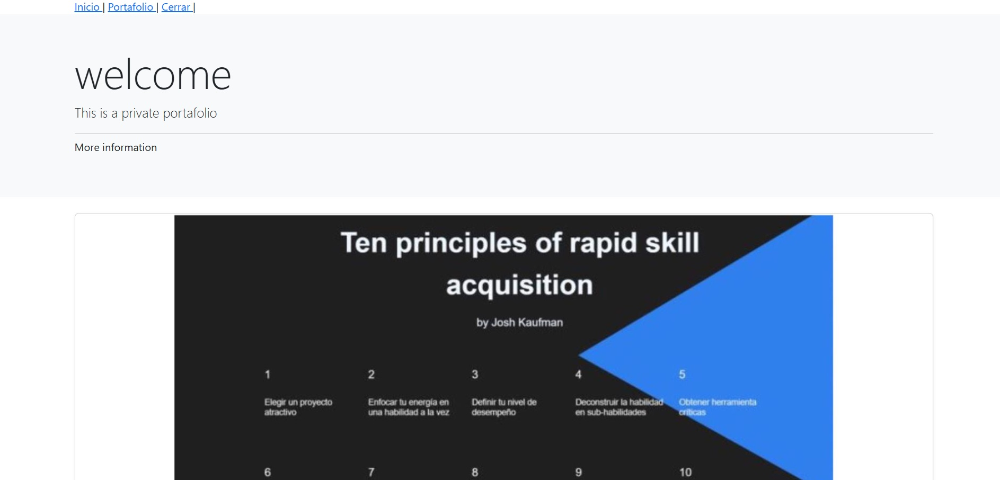
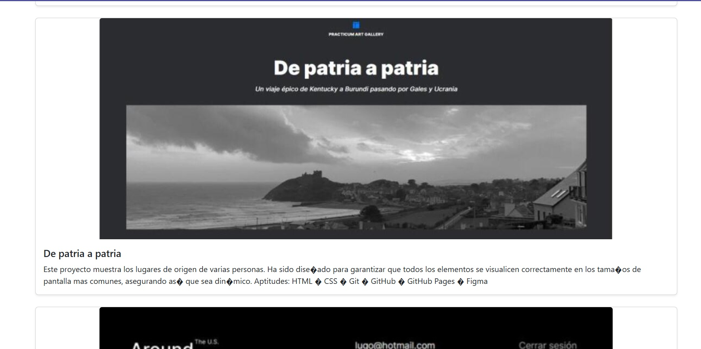
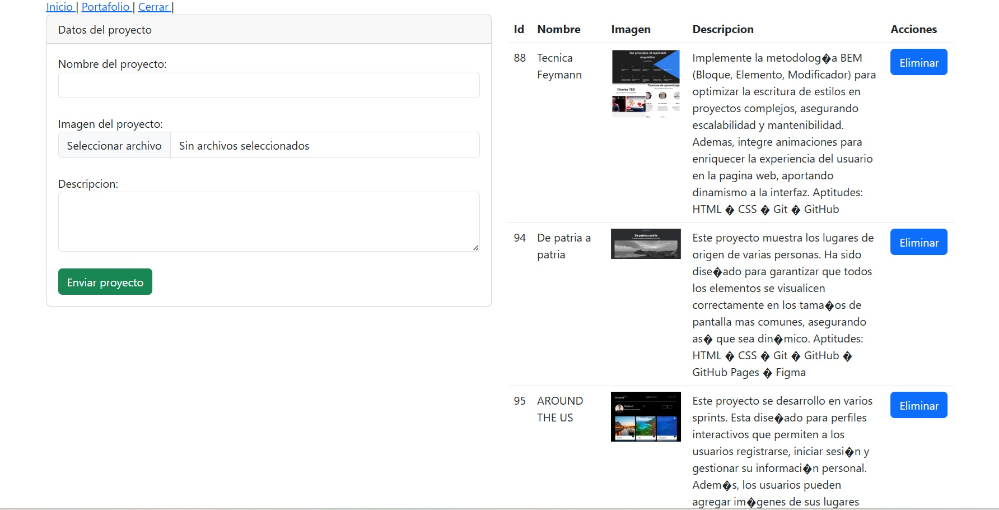

# portafolio de proyectos
## El desafio

Los usuarios deberian poder

usuario:admin
password:1234

- Ingresar a la plataforma y ver los diferentes proyectos que he realizado 
- Gestionar algun  proyecto  
- Cierre de sesion

## Screenshot  

##  HOME

##  CRUD

Links
[Link del proyecto](http://programming.ct.ws/)

## 🚧 Built with

- HTML5  
- Bootstrap  
- PHP  
- MySQL

## What I learned

Adentrandome en  PHP, he adquirido una comprensión de los conceptos fundamentales que me permiten desarrollar aplicaciones web dinámicas. He aprendido a trabajar con variables y tipos de datos (strings, enteros, arrays, booleanos, etc.), lo cual me permite almacenar y manipular información en mis programas.

Además, he dominado las estructuras de control como if, else, switch, y bucles (for, while, foreach), que me permiten tomar decisiones y repetir bloques de código de manera eficiente. También aprendí a crear y utilizar funciones para organizar el código y hacerlo más modular y reutilizable.

Un aspecto importante que he dominado es la capacidad de incluir archivos PHP externos dentro de otros archivos utilizando include, require, y sus variantes include_once y require_once, lo que mejora la organización y reutilización de código.

También comprendí cómo trabajar con formularios HTML y los métodos GET y POST para recibir y procesar datos enviados por los usuarios, y cómo interactuar con bases de datos MySQL usando  PDO, realizando operaciones CRUD (Crear, Leer, Actualizar y Eliminar) de manera segura y eficiente. he adquirido una base sólida en PHP que me permite desarrollar aplicaciones web dinámicas y eficientes.